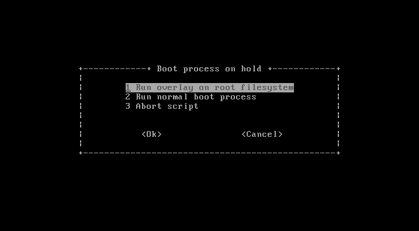

# Protecting linux based system with overlay

Somme projects requires to disable writes to the storage device for embedded puposes where untimely shutdown happend or for safety purposes when an external cryptographic system is used to secure data, then it's fondamental to make sure that no userspace applications write data onto a storage device as background task.

The project enable user to protect it system from writing to the main storage device of computer without interfering with userspace applications. During boot process the root filesystem is mounted in a layers architecture with the root at the bottom and the computer RAM at the top, using [overlayFs](https://en.wikipedia.org/wiki/OverlayFS).
In other words, all the system storage device (commonly the hard drive) will be visible behind all the modification that will be saved into the RAM. As a result, no physical writes will be registered onto the system storage device.

In addition to a layer architechtures, some changes are made into the userspace to restrict its rights of modyfiyng the system, since some commands are handle at a low level and cannot be handle easily.


# Summary
- [Warning](#warning)
- [Overview](#overview)
- [Boot process](#boot)
- [Membre du groupe de recherche](#membres)  
- [Attribution des taches](#taches)
- [Modélisation d'un réseau biologique](#Modélisations)
  - [Présentation sommaire du sujet](#sujet)
  - [Une première modélisation (simplifiée)](#modélisation_simplifiee)
  - [Modélisation du poids des connexions](#Modélisation_2)
  - [Changement du pas de temps](#Modélisation_3)
  - [Modélisation d'une susbtance psychoactive](#Modélisation_psycho)
- [Modélisations mathématiques](#doc_ref) 


# Warning <a name="warning"/>

The system has been tested for a debian distribution (above 2.6). It contains graphical compenents that might not work for other linux architecture.

# Overview <a name="overview"/>

The system acts on three process :

  - During the boot, user can choose to mount *overlay* on the root filesystem. Then all files onto the main filesystem will be visible and all modifications will be saved into the RAM. A kernel module is also loaded to save the user answer
  - At startup (when the filesystem has been remounted as read-write), content of the kernel module is read and add as an environment variable in `/etc/environment`. Then the module is unloaded
  - At login (in graphical mode or ina login shell), a message is displayed
  
# Boot process <a name="boot"/>



## /etc/initramfs-tools/modules

Add the following lines into a new bash script :

```
#!/bin/sh

. /usr/share/initramfs-tools/scripts/functions
. /usr/share/initramfs-tools/hook-functions

copy_exec /usr/bin/whiptail
```

[Whiptail](https://en.wikibooks.org/wiki/Bash_Shell_Scripting/Whiptail) is used to display a dialog box at boot time. It's normally included into linux kernel.

## /etc/initramfs-tools/scripts/init-bottom

To mount overlay on root filesystem you have to edit the initramfs image after the real filesystem has been mounted as read-only by the kernel. During boot a minimal system (the kernel image) is loaded into the RAM that will do all the work needed by the real system after. In particular, the real filesystem (the one that contains all your files and system files) will be mounted on `${rootmnt}`, which is a variable defined inside the *init* of the initramfs image (in other works your storage device is mounted on that directory). At the end of the *init* script, your system will remount `${rootmnt}` as read-write and mount other virtual filesystem onto it.
Then, you will have to mount overlay on that directory just after `${rootmnt}` become a mountpoint. I write a post that show better explaination for a complete beginner [here](https://superuser.com/questions/1421730/system-that-can-read-hard-drive-and-exclusively-write-into-ram/1421758#1421758)
Nonetheless, a minimal structure could be :
```
modprobe overlay
if [ $? -ne 0 ]; then
    fail_err "missing overlay kernel module"
    echo "Script aborted !"
    exit 1
fi

DIR=/overlay
UPPER_DIR=$DIR/upper
LOWER_DIR=$DIR/lower
WORK_DIR=$DIR/work

mkdir $DIR
#create temporary filesystem in RAM
mount -t tmpfs tmpfs $DIR
if [ $? -ne 0 ]; then
    fail_err "Fail to mount tmpfs on $DIR"
    exit 1
fi

#create lower, upper and workdir for overaly
mkdir $UPPER_DIR $LOWER_DIR $WORK_DIR

# move root mountpoint to the lower layer
mount -n -o move ${rootmnt} $LOWER_DIR
if [ $? -ne 0 ]; then
    fail_err "Cannot move ${rootmnt} to $LOWER_DIR"
    exit 1
fi

mount -t overlay -o lowerdir=$LOWER_DIR,upperdir=$UPPER_DIR,workdir=$WORK_DIR overlay ${rootmnt}
if [ $? -ne 0 ]; then
    fail_err "Cannot mount overlay on ${rootmnt} [lowerdir=$LOWER_DIR, upperdir=$UPPER_DIR, workdir=$WORK_DIR]"
    exit 1
fi

#mount virtual filesystem over the lower dir (as it's donne for the root with /proc and /sysfs which are mounted onto the root at the end of the init)

#uncomment that section if you want to access the layers of overlay whithin userspace
#mkdir -p ${rootmnt}$DIR
#mount -n -o rbind $DIR ${rootmnt}$DIR
#if [ $? -ne 0 ]; then
#    fail_err "Cannot remount ${rootmnt} and its sub mountpoints on ${rootmnt}$DIR"
#    exit 1
#fi

# edit fstab to match the actual modifications

#get the device that is mounted on the rootfilesystem
root_device="$(awk '$2 == "/" {print $0}' ${rootmnt}/etc/fstab)"
#check if that device exists
blkid $root_device
if [ ! $? -gt 0 ]; then
	target=${rootmnt}/etc/fstab
	target_c=$target.orig
	#create a copy of the file (that will be accessible later)
	cp $target $target_c
	#remove the root device from the file
	grep -v "$root_device" $target_c > $target

	#add overlay on root as a device in the file
	awk '$2 == "'${rootmnt}'" { $2 = "/" ; print $0}' /etc/mtab >> $target
fi
```

If after the boot you want to have access to the overlay structure (especially the lower layer where modifications will be made onto the storage device) then we have to create the lower directory in the same location than the upper layer (so here inside the ramdisk). Then, you need the folowwing lines :

```
DIR=/overlay
UPPER_DIR=$DIR/upper
LOWER_DIR=$DIR/lower
WORK_DIR=$DIR/work

mkdir $DIR
mount -t tmpfs tmpfs $DIR
#create all the directories inside the ram disk
mkdir $UPPER_DIR $LOWER_DIR $WORK_DIR
...

mkdir -p ${rootmnt}$DIR
mount -n -o rbind $DIR ${rootmnt}$DIR
if [ $? -ne 0 ]; then
    fail_err "Cannot remount ${rootmnt} and its sub mountpoints on ${rootmnt}$DIR"
    exit 1
fi
```
However, if you just want to mount overlay on the root filesystem, the lower directory can be on a different location :

```
DIR=/overlay
UPPER_DIR=$DIR/upper
LOWER_DIR=$DIR/lower
WORK_DIR=$DIR/work

mkdir $DIR
mkdir $LOWER_DIR

mount -t tmpfs tmpfs $DIR
mkdir $UPPER_DIR $WORK_DIR
```

In that case, the lower directory will be on the kernel filesystem (the one mounted at boot by the kernel image) an will not be accessible later.

