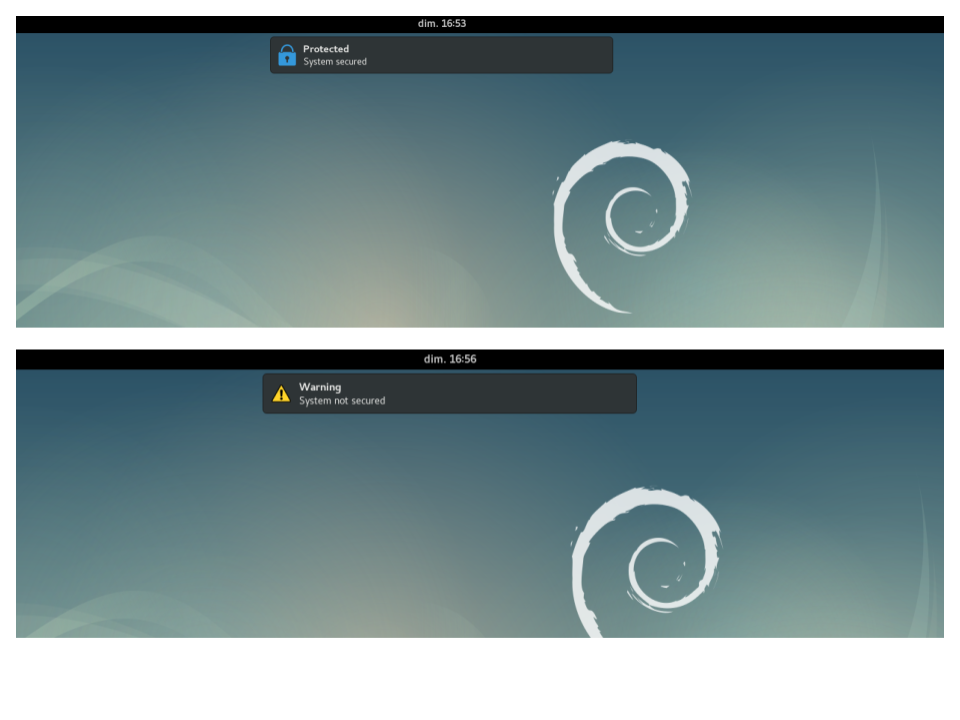
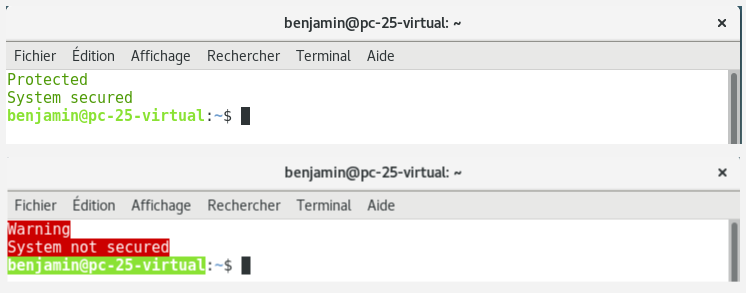
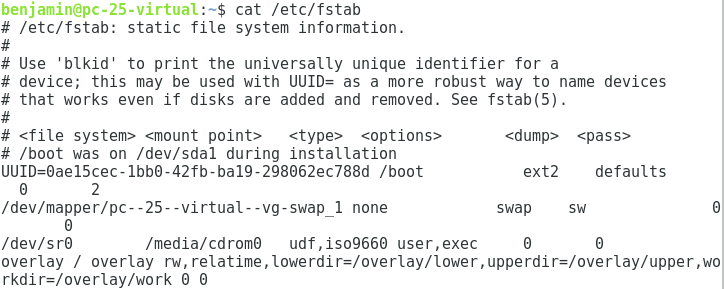

# Protecting Linux based system with overlay

Some projects require to disable writes to the storage device for embedded purposes where untimely shutdown happens or for safety purposes when an external cryptographic system is used to secure data, then it's fundamental to make sure that no userspace applications write data onto a storage device as a background task.

The project enables users to protect their systems from writing to the main storage device of computer without interfering with userspace applications. During the boot process the root filesystem is mounted in a layered architecture with the root at the bottom and the computer RAM at the top, using [overlayFs](https://en.wikipedia.org/wiki/OverlayFS).
In other words, all files on the storage device (commonly the hard drive) will be visible behind all modifications which will be saved into the RAM. As a result, no physical writes will be registered onto the system storage device.

# Summary
- [Warning](#warning)
- [Overview](#overview)
- [Boot](#boot)
  - [Hook](#boot_hook)
  - [Overlay](#boot_overlay)
  - [Save variable](#boot_var)
  - [Modules](#boot_modules)
- [Startup](#startup)  
- [Login](#login)
  - [Gui support](#login_gui)
  - [Shell support](#login_shell)


# Warning <a name="warning"/>

The system has been tested for a debian distribution (above 2.6). It contains graphical components that might not work for other Linux architecture (for the userspace part of the project).

Mounting overlay on the filesystem does not entirely protect storage device from applications in userspace. The actual partition mounted on overlay cannot be remounted but other partitions can be. For example, the command `update initramfs -u` will edit the kernel image (so alter the boot process) even if you are running overlay because that command will save the new kernel image in the boot partition, `/dev/sda1` for example. To make sure that absolutely no writes is really made you have to create a dedicated session with low rights level (for example a guest session). 

# Overview <a name="overview"/>

The system acts on three processes :

  - During the boot, user can choose to mount *overlay* on the root filesystem. Then all files onto the main filesystem will be visible and all modifications will be saved into the RAM. A kernel module is also loaded to save the user answer.
  
  
  - At startup (when the filesystem has been remounted as read-write), content of the kernel module is read and add as an environment variable in `/etc/environment`. Then the module is unloaded.
  
  - At login (in graphical desktop or login shell), a message is displayed

<p float="left">
   
  
</p>


When overlay is mounted, `/etc/fstab` file is edited (storage device mounted on the root is replace by overlay)

  


An installation file is provided (must be run with *su* privilege). An uninstallation file will be created during the installation process and saved by default in `/usr/share/overlayRoot` or in another directory if it already exists.

# Boot process <a name="boot"/>

## Hook <a name="boot_hook"/>

Add the following lines into a new bash script in `/etc/initramfs-tools/modules` :

```sh
#!/bin/sh

. /usr/share/initramfs-tools/scripts/functions
. /usr/share/initramfs-tools/hook-functions

copy_exec /usr/bin/whiptail
```

[Whiptail](https://en.wikibooks.org/wiki/Bash_Shell_Scripting/Whiptail) is used to display a dialog box at boot time. It's normally included into linux kernel.

## Overlay <a name="boot_overlay"/>

To mount overlay on root filesystem you have to edit the initramfs image after the real filesystem has been mounted as read-only by the kernel. In details, during boot a minimal system (the kernel image) is loaded into the RAM that will do all the work needed by the real system after. In particular, the real filesystem (the one that contains all your files and system files) will be mounted on `${rootmnt}`, which is a variable defined inside the *init* of the initramfs image (in other words your storage device is mounted on that directory). At the end of the *init* script, your system will remount `${rootmnt}` as read-write and mount other virtual filesystem onto it.
Then, you will have to mount overlay on that directory just after `${rootmnt}` become a mountpoint. I write a post with better explanations for a complete beginner [here](https://superuser.com/questions/1421730/system-that-can-read-hard-drive-and-exclusively-write-into-ram/1421758#1421758)
Nonetheless, a minimal structure could be :
```sh
modprobe overlay
if [ $? -ne 0 ]; then
    fail_err "missing overlay kernel module"
    echo "Script aborted !"
    exit 1
fi

DIR=/overlay
UPPER_DIR=$DIR/upper
LOWER_DIR=$DIR/lower
WORK_DIR=$DIR/work

mkdir $DIR
#create temporary filesystem in RAM
mount -t tmpfs tmpfs $DIR
if [ $? -ne 0 ]; then
    fail_err "Fail to mount tmpfs on $DIR"
    exit 1
fi

#create lower, upper and workdir for overaly
mkdir $UPPER_DIR $LOWER_DIR $WORK_DIR

# move root mountpoint to the lower layer
mount -n -o move ${rootmnt} $LOWER_DIR
if [ $? -ne 0 ]; then
    echo "Cannot move ${rootmnt} to $LOWER_DIR"
    exit 1
fi

mount -t overlay -o lowerdir=$LOWER_DIR,upperdir=$UPPER_DIR,workdir=$WORK_DIR overlay ${rootmnt}
if [ $? -ne 0 ]; then
    echo "Cannot mount overlay on ${rootmnt} [lowerdir=$LOWER_DIR, upperdir=$UPPER_DIR, workdir=$WORK_DIR]"
    exit 1
fi

#mount virtual filesystem over the lower dir (as it's donne for the root with /proc and /sysfs which are mounted onto the root at the end of the init)

#uncomment that section if you want to access the layers of overlay whithin userspace
#mkdir -p ${rootmnt}$DIR
#mount -n -o rbind $DIR ${rootmnt}$DIR
#if [ $? -ne 0 ]; then
#    echo "Cannot remount ${rootmnt} and its sub mountpoints on ${rootmnt}$DIR"
#    exit 1
#fi

# edit fstab to match the actual modifications

#get the device that is mounted on the rootfilesystem
root_device="$(awk '$2 == "/" {print $0}' ${rootmnt}/etc/fstab)"
#check if that device exists
blkid $root_device
if [ ! $? -gt 0 ]; then
	target=${rootmnt}/etc/fstab
	target_c=$target.orig
	#create a copy of the file (that will be accessible later)
	cp $target $target_c
	#remove the root device from the file
	grep -v "$root_device" $target_c > $target

	#add overlay on root as a device in the file
	awk '$2 == "'${rootmnt}'" { $2 = "/" ; print $0}' /etc/mtab >> $target
fi
```
The script must be copied in `/etc/initramfs-tools/scripts/init-bottom`

After the boot, if you want to have access to the overlay structure (especially the lower layer where modifications will be made onto the storage device) then you have to create the lower directory in the same location than the upper layer (so here inside the ramdisk). Then, you need the following lines :

```sh
DIR=/overlay
UPPER_DIR=$DIR/upper
LOWER_DIR=$DIR/lower
WORK_DIR=$DIR/work

mkdir $DIR
mount -t tmpfs tmpfs $DIR
#create all the directories inside the ram disk
mkdir $UPPER_DIR $LOWER_DIR $WORK_DIR
...

mkdir -p ${rootmnt}$DIR
mount -n -o rbind $DIR ${rootmnt}$DIR
if [ $? -ne 0 ]; then
    echo "Cannot remount ${rootmnt} and its sub mountpoints on ${rootmnt}$DIR"
    exit 1
fi
```
However, if you just want to mount overlay on the root filesystem, the lower directory can be on a different location :

```sh
DIR=/overlay
UPPER_DIR=$DIR/upper
LOWER_DIR=$DIR/lower
WORK_DIR=$DIR/work

mkdir $DIR
mkdir $LOWER_DIR

mount -t tmpfs tmpfs $DIR
mkdir $UPPER_DIR $WORK_DIR
```

In that case, the lower directory will be on the kernel filesystem (the one mounted at boot by the kernel image) and will not be accessible later.

## Save variable  <a name="boot_var"/>

If you want to save user answer (mounting overlay or not) at boot time it can be tricky. [A solution](https://unix.stackexchange.com/questions/521975/save-variable-from-initramfs-at-boot-time/522027#522027) can be to remount the real filestsystem `${rootmnt}` as read-write and edit a file to save the answer. But it's a hard work to do it properly. Instead, you can load a kernel module that will be accessible in `/proc` (the `/proc` of the kernel filesystem and not the one of the real filesystem). Then simply write the answer in it and at startup (after the real filesystem has been remounted) read the content, write it inside a file and unload the kernel module.
```sh
#name of your custom kernel module
MODULE=overlayRootOnBoot

writeToKernelMod ()
{
	local mod=$1
	local val=$2
	if [ -f /proc/$mod ]; then 
    		echo "$val" > /proc/$MODULE
		return 0
    	fi
	return 1
}

...

var=yes
writeToKernelMod "$MODULE" "$var"
```

All the needed file to compile that module are in the folder *Boot/modules* (you will have to install *build-essential* and *linux-headers-`uname -r`*)

## Modules  <a name="boot_modules"/>

To use theses modules (overlay and your custom one) they have to be included inside your kernel image. To achieve that simply write the name of your modules inside the file `/etc/initramfs-tools/modules`

For your custom module, add it inside a correct directory on your system (where the system search to find the correct module when a name is inside `/etc/initramfs-tools/modules`). That directory is `/lib/modules/$(uname -r)/kernel/...`

# Startup <a name="startup"/>

To execute a file during the startup add the script inside `/etc/init.d` and then create a symbolic link inside [`/etc/rc3.d`](https://unix.stackexchange.com/questions/111611/what-does-the-rc-stand-for-in-etc-rc-d) with the command 
`ln -s /etc/init.d/name_script /etc/rc3.d/S01name_script` if your script is named `name_script`

The folder **Startup** contains two file :

- *overlayRootFunctions.sh* which contains some functions
- *overlayRootVarSetUp* which will be run at every startup

Other scripts will use functions of *overlayRootFunctions.sh*, then path to that file will be saved as an environment variable in 
`/etc/environment`.
After the startup script the only sign left by the user during boot will be saved inside `/etc/environment` as `OVERLAY_ROOT_AT_BOOT` (which can be `true` if user wanted to mount overlay during boot or `false`).

# Login <a name="login"/>
The behaviour of scripts at login (for example what message to display) entirely rely on the function `isSecureEnvironment` of 
*overlayRootFunctions.sh*

## Gui support <a name="login_gui"/>

If your system has a gui desktop (*gnome*) then to start a script after login you have to create a desktop application that will run the script :
```
[Desktop Entry]
Name=name of my application...
GenericName=generci name...
Comment=comment...
Exec=path_to_your_script
Terminal=false
Type=Application
X-GNOME-Autostart-enabled=true
```
Then copy the file in `/etc/xdg/autostart` (at least for `gnome`)

The script in the folder **Login** nammed *guiNotificationOnLogin* will be run after each login in a gui desktop

## Shell support <a name="login_shell"/>

### Login shell

To execute a script when a login shell is opended add your script in `/etc/profile.d`. That script is *shellNotificationOnLogin.sh*.

### Bash shell

To execute a script when a bash shell is opened add  path of your script inside the file `/etc/bash.bashrc`


